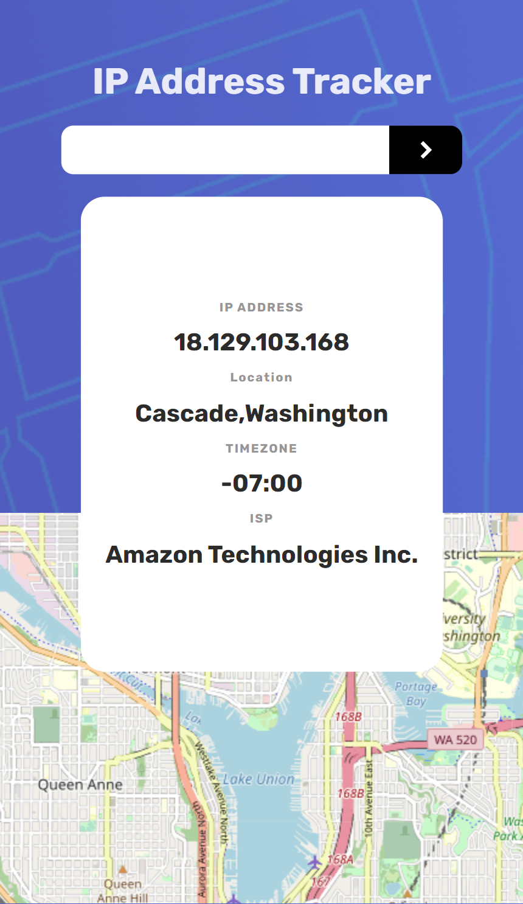

# Frontend Mentor - IP address tracker solution

This is a solution to the [IP address tracker challenge on Frontend Mentor](https://www.frontendmentor.io/challenges/ip-address-tracker-I8-0yYAH0). Frontend Mentor challenges help you improve your coding skills by building realistic projects.

## Table of contents

- [Overview](#overview)
  - [The challenge](#the-challenge)
  - [Screenshot](#screenshot)
  - [Links](#links)
- [My process](#my-process)
  - [Built with](#built-with)
  - [What I learned](#what-i-learned)
  - [Continued development](#continued-development)
- [Author](#author)
- [Acknowledgments](#acknowledgments)

## Overview

### The challenge

Users should be able to:

- View the optimal layout for each page depending on their device's screen size
- See hover states for all interactive elements on the page
- See their own IP address on the map on the initial page load
- Search for any IP addresses or domains and see the key information and location

### Screenshot

### Links

- Solution URL: [owo](https://github.com/XxtbmfxX/frontmentor_ip_tracker)
- Live Site URL: [uwu](https://xxtbmfxx.github.io/frontmentor_ip_tracker/)

## My process

### Built with

- [React](https://reactjs.org/) - JS library
- [React](https://vitejs.dev/) - frontend tool

### What I learned

React component mangement (again after no doing anything like for 5 months)

### Continued development

Learn linux because its cool

## Author

- Frontend Mentor - [@XxtbmfxX](https://www.frontendmentor.io/profile/XxtbmfxX)

## Acknowledgments

This video helped me with the .env files https://www.youtube.com/watch?v=hmRQOyRzxvk
